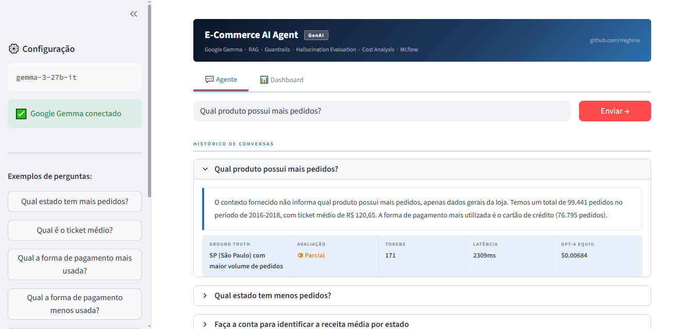
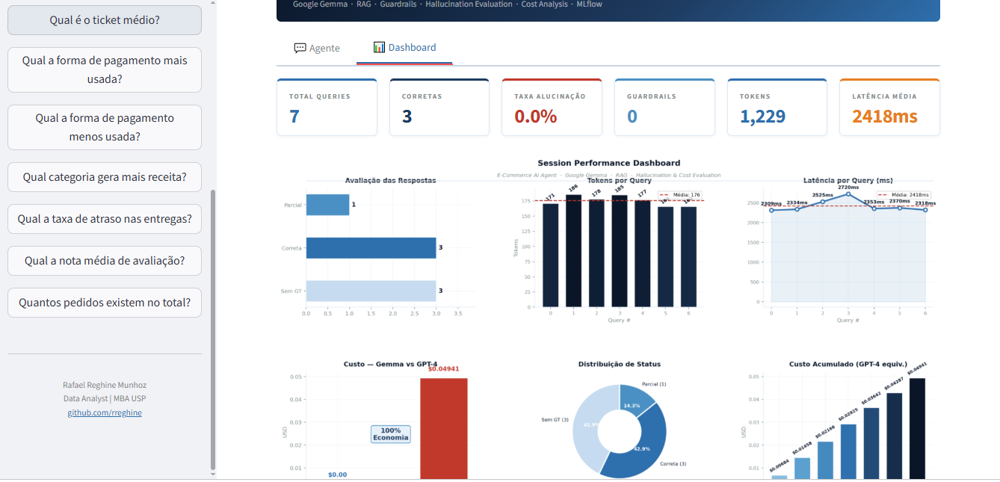

# E-Commerce AI Agent


Agente conversacional de IA para análise de dados de e-commerce com avaliação automática de alucinação, custo por token e guardrails de segurança — construído sobre o ecossistema Google com Gemma 3, LangChain, RAG e MLflow.

---

## Preview

### Interface do Agente


### Dashboard de Métricas


---

## Contexto de Negócio

Agentes de IA baseados em LLMs são amplamente adotados, mas raramente avaliados com rigor. Este projeto vai além da construção do agente — implementa um framework completo de avaliação com métricas de qualidade, rastreamento de custos e proteções de segurança.

**Perguntas centrais:**
- O agente alucina? Com que frequência?
- Quanto custaria em produção com modelos pagos?
- Como proteger o sistema de perguntas fora do escopo?

---

## Dataset

**Brazilian E-Commerce (Kaggle)**

- 99.441 pedidos reais e anonimizados
- 9 tabelas relacionadas — pedidos, clientes, produtos, vendedores, pagamentos, avaliações
- Período: 2016 a 2018

---

## Estrutura do Projeto

```
ecommerce-ai-agent/
│
├── Agent_IA_v2.ipynb          
├── app_agent.py              
├── knowledge_base.json       
├── requirements.txt
├── preview_agent.png
├── preview_dashboard.png
└── README.md
```

---

## Arquitetura do Agente

```
Pergunta do usuário
        ↓
Guardrails — valida escopo, dados sensíveis e tamanho
        ↓
RAG / FAISS — recupera contexto relevante da base
        ↓
Google Gemma 3 API — gera resposta em português
        ↓
Avaliador — compara com ground truth calculado nos dados
        ↓
Métricas — alucinação · custo/token · latência
        ↓
MLflow — loga parâmetros e métricas do experimento
```

---

## Componentes

### Guardrails
Sistema de proteção em dois níveis — entrada e saída:

- **Validação de escopo** — bloqueia perguntas fora do domínio de e-commerce
- **Proteção de dados** — impede exposição de dados pessoais (CPF, senhas, endereços)
- **Controle de tamanho** — mínimo de 5 e máximo de 500 caracteres

### RAG — Retrieval Augmented Generation
Base de conhecimento construída a partir dos dados reais do dataset:

- 8 documentos temáticos — resumo geral, pedidos, estados, pagamentos, avaliações, categorias, atrasos, vendedores
- Embeddings com `all-MiniLM-L6-v2` via Sentence Transformers
- Recuperação top-3 por similaridade cossenoidal com FAISS

### Sistema de Avaliação

**Avaliação de Alucinação**

Compara a resposta do agente com o ground truth calculado diretamente dos dados:

| Status | Critério |
|---|---|
| Correta | Overlap ≥ 50% com o ground truth |
| Parcial | Overlap entre 25% e 50% |
| Alucinação | Overlap < 25% |

**Avaliação de Custo por Token**

Calcula o custo estimado por query e compara com modelos pagos:

| Modelo | Custo |
|---|---|
| Google Gemma (free tier) | $0.00 |
| GPT-4 (equivalente) | ~$0.005 por query |

### MLflow
Rastreia todos os experimentos com parâmetros e métricas:

- Modelo utilizado
- Pergunta enviada
- Total de tokens
- Latência em ms
- Score de alucinação
- Custo GPT-4 equivalente
- 
---

## Tecnologias Utilizadas

| Categoria | Ferramentas |
|---|---|
| Linguagem | Python 3.12 |
| LLM | Google Gemma 3 27B |
| API | Google AI Studio (free tier) |
| Orquestração | LangChain |
| Embeddings | Sentence Transformers |
| Recuperação | FAISS + RAG |
| Rastreamento | MLflow |
| Deploy | Streamlit |
| Ambiente | Google Colab |

---

## Autor

**Rafael Reghine Munhoz**
Data Analyst | Data Science & Analytics | MBA USP

[](https://linkedin.com/in/rafaelreghine)
[](https://github.com/rreghine)
