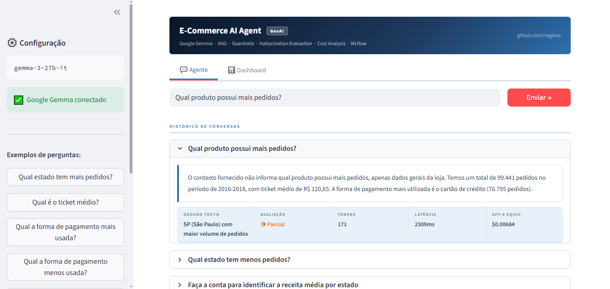
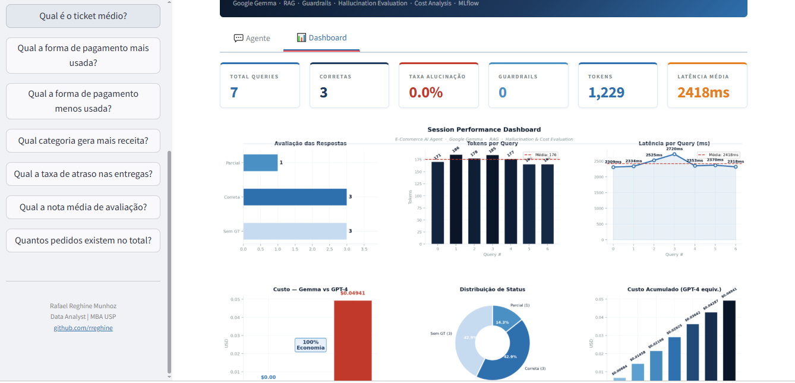

🇺🇸 **English** | [🇧🇷 Português](README.pt-BR.md)

# E-Commerce AI Agent


Conversational AI agent for e-commerce data analysis with automatic hallucination evaluation, cost-per-token tracking, and safety guardrails — built on the Google ecosystem with Gemma 3, LangChain, RAG, and MLflow.

---

## Preview

### Agent Interface


### Metrics Dashboard


---

## Business Context

LLM-based AI agents are widely adopted but rarely evaluated rigorously. This project goes beyond building the agent — it implements a complete evaluation framework with quality metrics, cost tracking, and safety protections.

**Core questions:**
- Does the agent hallucinate? How often?
- How much would it cost in production with paid models?
- How do we protect the system from out-of-scope questions?

---

## Dataset

**Brazilian E-Commerce (Kaggle)**

- 99,441 real, anonymized orders
- 9 related tables — orders, customers, products, sellers, payments, reviews
- Period: 2016 to 2018

---

## Project Structure

```
ecommerce-ai-agent/
│
├── Agent_IA_v2.ipynb
├── app_agent.py
├── knowledge_base.json
├── requirements.txt
├── preview_agent.png
├── preview_dashboard.png
└── README.md
```

---

## Agent Architecture

```
User question
        ↓
Guardrails — validates scope, sensitive data, and length
        ↓
RAG / FAISS — retrieves relevant context from the knowledge base
        ↓
Google Gemma 3 API — generates the answer
        ↓
Evaluator — compares against ground truth computed from the data
        ↓
Metrics — hallucination · cost/token · latency
        ↓
MLflow — logs experiment parameters and metrics
```

---

## Components

### Guardrails
Two-level protection system — input and output:

- **Scope validation** — blocks questions outside the e-commerce domain
- **Data protection** — prevents exposure of personal data (national IDs, passwords, addresses)
- **Length control** — minimum of 5 and maximum of 500 characters

### RAG — Retrieval Augmented Generation
Knowledge base built from the real dataset:

- 8 thematic documents — general summary, orders, states, payments, reviews, categories, delays, sellers
- Embeddings with `all-MiniLM-L6-v2` via Sentence Transformers
- Top-3 retrieval by cosine similarity with FAISS

### Evaluation System

**Hallucination Evaluation**

Compares the agent's answer against ground truth computed directly from the data:

| Status | Criteria |
|---|---|
| Correct | Overlap ≥ 50% with ground truth |
| Partial | Overlap between 25% and 50% |
| Hallucination | Overlap < 25% |

**Cost-per-Token Evaluation**

Estimates the cost per query and compares it against paid models:

| Model | Cost |
|---|---|
| Google Gemma (free tier) | $0.00 |
| GPT-4 (equivalent) | ~$0.005 per query |

### MLflow
Tracks all experiments with parameters and metrics:

- Model used
- Question submitted
- Total tokens
- Latency in ms
- Hallucination score
- GPT-4 equivalent cost

---

## Technologies Used

| Category | Tools |
|---|---|
| Language | Python 3.12 |
| LLM | Google Gemma 3 27B |
| API | Google AI Studio (free tier) |
| Orchestration | LangChain |
| Embeddings | Sentence Transformers |
| Retrieval | FAISS + RAG |
| Tracking | MLflow |
| Deployment | Streamlit |
| Environment | Google Colab |

---

## Author

**Rafael Reghine Munhoz**
Data Analyst | Data Science & Analytics | MBA at USP

[](https://linkedin.com/in/rafaelreghine)
[](https://github.com/rreghine)
